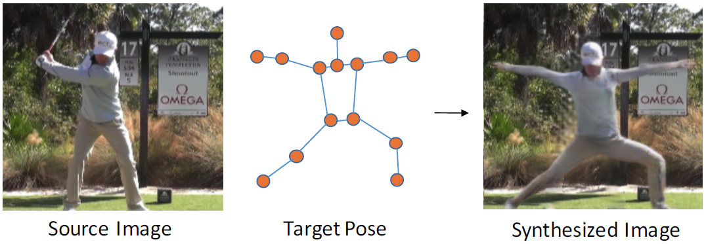
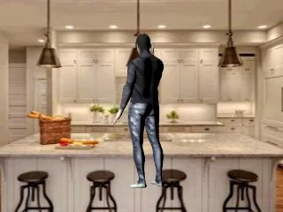
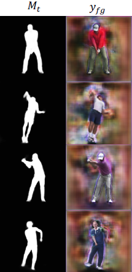
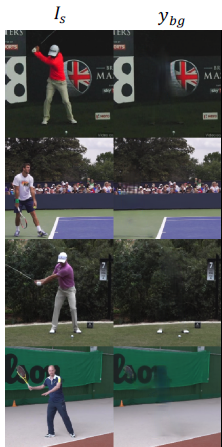
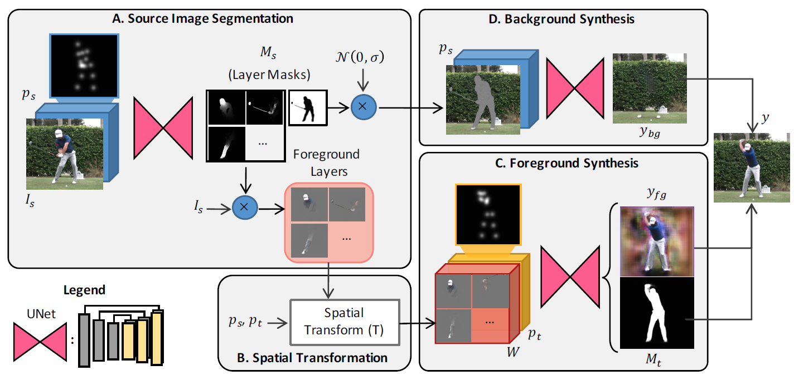

### 一、 问题

人体姿态合成，如下图，输入原图和指定的人的姿态，输出该姿态下人的图片。

本文的工作也属于，合成数据。但是和[SURREAL](https://www.di.ens.fr/willow/research/surreal/data/)的区别在于，SURREAL使用的人完完全全是合成的，使用人体模型和参数，生成模拟的人，如下图。

这种合成数据的方式，优点是，对人体具有100%的控制，可以获得人体的全部信息，如位置、目标框、分割掩码、深度信息等等。缺点也很明显，生成的数据和真实的数据存在较大的差异，至少人能一眼分辨出，哪个是真实的图片，哪个是合成的图片。

而本文提供另一种合成图片的思路：人体信息还是使用原始的真实的图片，仅仅针对人体的姿态，合成目标姿态下的人体图片。优点是，合成的图片和真实图片相差很小，基本分辨不出来，这对使用合成数据训练网络，是极好的。不足之处是，仅用于姿态问题，不能获得人体的其他全部信息。从方法来看，本方法属于GAN合成数据在人体姿态上的应用。

### 二、怎么做

四步：

1. 分割目标和背景，以及人体的各个部位（原图分割）
2. 生成目标姿态的身体部位（前景空间变换）
3. 合成目标姿态的人体（前景合成）
4. 背景合成

#### 2.1 原图分割

**为什么？**当人 运动时，身体各个部位的运动是相对独立的，对应到图像空间是，分段仿射运动场（piecewise affine motion field）。处理具有这种特点的问题，采取部位分割的方法，先把每部分分割出来，输入是原图，输出是10个通道的部位层（part layers），加上一层背景层。

**怎么做？**这部分使用U-net，U-net结构的特点是，输入和输出没有移动，在图像合成任务中广泛使用。

输入： $[I_s, p_s]\in R^{H\times W\times (3+J)}$（3是RGB，J是原图中人体姿态关键点的高斯图）

输出：$\triangle M_s\in R^{H\times W\times (L+1)}$（L指body part个数，1指背景）

最后预测的mask：$M_s=softmax(\triangle M_s+log\hat M_s)$，其中$\hat M_s$是body part的粗略位置。

问题：label从哪里来？难道这一步是无监督？

#### 2.2 前景空间变换

利用body part的对应点，计算相似变换矩阵，然后用双线性插值（spatial transform network）的方式，把part变换成指定pose的形式。

#### 2.3 前景合成

把各个变换之后的part融合在一起，并refine，和2.1一种，使用U-net。

输入： $[W, p_t]\in R^{H\times W\times (3L+J)}$（3是RGB，L指part，J是指定的人体姿态关键点的高斯图）

输出：$M_t\in R^{H\times W\times 1}$（target mask）和前景$y_{fg}$，如下图所示

#### 2.4 背景合成

合成被前景遮挡的背景区域，使用U-net.

输入：$[I_s^{L+1}, M_s^{L+1}, p_s]\in R^{H\times W\times (3+1+J)}$ 

输出：$y_{bg}$ 

其中，$I_s^{L+1}=I_s\otimes M_s^{L+1} + N(0, \sigma)\otimes (1-M_s^{L+1})$ ，背景用原图，前景用高斯分布代替。

组合在一起：

$y=M_t\otimes y_{fg} + (1-M_t)\otimes y_{bg}$ 

整个方法的框图：

### 三、损失函数

常见的GAN图像生成的损失函数：L1、VGG、判别损失。所以从这里看，上面的3个U-net的损失，都是从最后预测的y传过来的。
